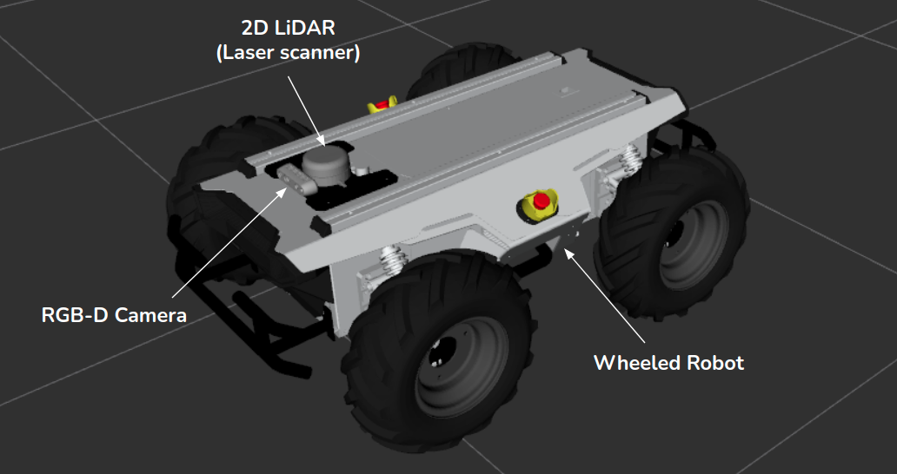
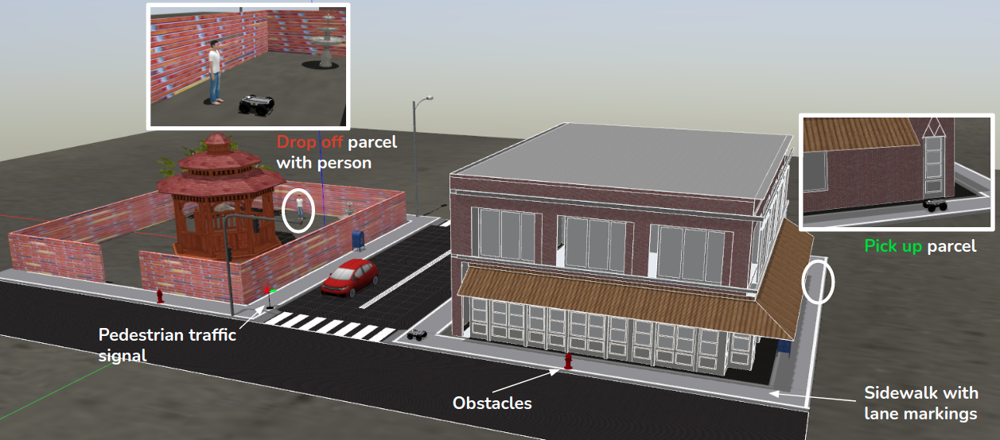

# Introduction

## Phase 1: Simulation

Dans cette phase de simulation uniquement, les équipes travailleraient à fournir des solutions à trois (3) tâches fondamentales d'un robot de livraison qui sont:

* Navigation agricole et manœuvre (avec évitement des obstacles)
* Détection des mauvaises herbes
* Plantation de graines

La plate-forme de simulation à utiliser dans cette phase est le [simulateur de gazebo](http://gazebosim.org/). Les équipes doivent développer, tester et soumettre des logiciels pour accomplir avec succès ces tâches de manière autonome. Cette phase évaluera les capacités des équipes pour accomplir avec succès ces tâches fondamentales requises pour rivaliser dans la phase 2 (sur le robot physique).

Chaque tâche est conçue comme autonome, sans en fonction des autres fonctionnalités de la tâche, par conséquent, nous demandons aux équipes de terminer les tâches séparément. Les tâches seraient évaluées individuellement et le score total de l'équipe pour cette phase serait la somme des scores de tâches individuels.

Les équipes reçoivent les packages ROS du robot et les modèles d'environnement de gazebo (voir la description ci-dessous) pour leur permettre de développer et de tester leurs solutions (voir [Github Repository](https://github.com/parc-robotics/parc-ingeneers-league)).

### Robot Agrobot
Le robot Agrobot est un véhicule au sol sans pilote (UGV) équipé d'un lidar 2D (détection de lumière et scanner laser ou laser) et une caméra RVB-profondeur. La figure ci-dessous montre le robot délicieux avec des capteurs étiquetés.

### Environnement de simulation
L'environnement de simulation utilisé dans cette phase est modélisé comme une rue réaliste avec des routes, un trottoir, des passagers de passage, des feux de circulation et des bâtiments. Le trottoir est équipé de marques de voie pour soulager la tâche du trottoir suivant. L'objectif de la compétition est de prendre un colis dans le magasin (côté du bâtiment) et de le livrer à la personne du parc. La figure ci-dessous montre l'environnement de simulation avec des étiquettes d'objets importants.

