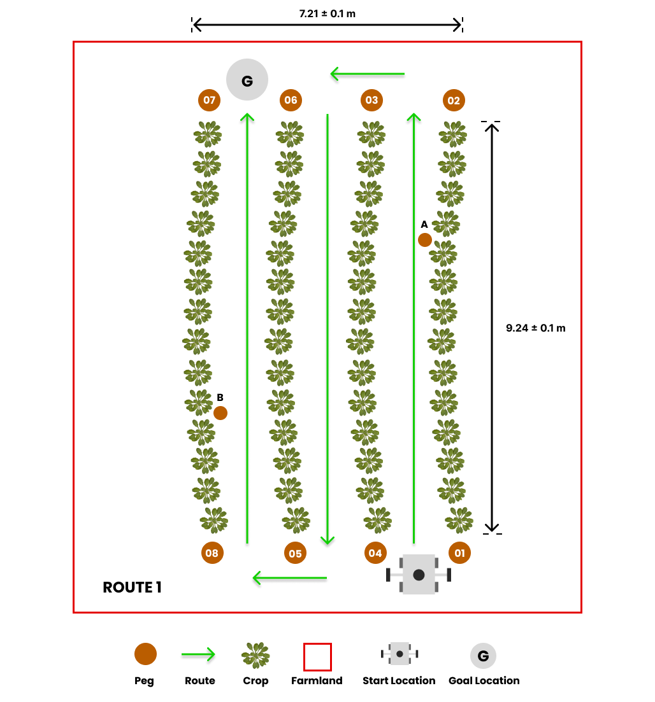

# Task 1: Autonomous Field Navigation

## General Description

Agricultural robots must be able to navigate through crops and farmland, which includes autonomously moving through lettuce crop rows on rough terrain. This task involves reaching the end of a row, making a turn, and returning in adjacent rows until the goal location is reached. Teams must develop software to guide the robot through a [pre-defined path](#route-description) within the crop rows, from its starting position to the goal location.

## Task Guidelines
### Launching the Task
In a new terminal, run the following launch file to bring up the robot in Gazebo and RViz:

```sh
roslaunch parc_robot parc_task1.launch
```

You should see the display below in Gazebo and RViz respectively. To the right, there's the robot and to the left is the orange-red sphere which represents the goal location.


### Exploring Multiple Routes
* We have prepared three pre-defined routes you can use as you develop your solution with each route having different goal location. The default route is `route1`, but you can select the second and third route option (`route2` and `route3`) by passing the argument in the roslaunch command as follows:

```sh
## route2
roslaunch parc_robot parc_task1.launch route:=route2

## route3
roslaunch parc_robot parc_task1.launch route:=route3
```

* We recommend you play around with at least these three routes to ensure your solution is robust to different start locations.

* To obtain the goal location for this task, regardless of the route option, you can use a ROS parameter. Here is an example of how to obtain the goal location as a ROS parameter:

=== "Matlab"
    ```matlab
    % Initialize the ROS node
    rosinit

    % Get the goal parameter
    goal = rosparam('get', 'goal_location');

    % Print the goal location
    disp(['goal location: ' num2str(goal.x) ' ' num2str(goal.y) ' ' num2str(goal.z)])

    ```
=== "Python"
    ```python
    #!/usr/bin/env python

    import rospy

    rospy.init_node('goal_parameter')

    # Get goal parameter
    goal = rospy.get_param('goal_location')
    x, y, z = goal['x'], goal['y'], goal['z']

    # Print goal location
    rospy.loginfo("goal location: %f %f %f", x, y, z)

    ```
=== "C++"
    ```cpp
    #include <ros/ros.h>
    #include "map"

    int main(int argc, char** argv)
    {
      ros::init(argc, argv, "goal_parameter");

      // Get goal parameter
      std::map<std::string, double> goal;
      ros::param::get("goal_location", goal);

      // Print goal location
      ROS_INFO("goal location: %f %f %f", goal["x"], goal["y"], goal["z"]);

      return 0;
    }
    ```

### Preparing your Solution
* Your solution should be prepared as ROS packages to be saved in your solution folder. Create a launch file in your ROS package which runs ALL the code you need in your solution. Name this launch file: `task1_solution.launch`.

* Hence, your solution to Task 1 should be run by calling the following commands:

In one terminal:

```sh
roslaunch parc_robot parc_task1.launch
```

Or 

```sh
roslaunch parc_robot parc_task1.launch route:=route2
```

Or

```sh
roslaunch parc_robot parc_task1.launch route:=route3
```

!!! note "Note"
    Please wait until both the world and robot models have finished spawning. This process may take longer than usual, especially when running the program for the first time.

In another terminal:

```sh
roslaunch <your-package-name> task1_solution.launch`
```

### Route Description

=== "Route 1"
    

=== "Route 2"
    

=== "Route 3"
    

The red line is the farmland while the green lines specify the path within the crop rows that **MUST** be followed by the robot for each route to the goal location represented as **G**.

## Task Rules

* The time limit to complete the task is 4 minutes (240 seconds).

* The task is ONLY complete when ANY part of the robot is inside the orange-red sphere (goal location marker) after following the pre-defined path as shown above.

!!! note "Note"
    Ensure you DO NOT provide a solution with hard-coded positions for the robot to move to because in evaluation, the robot initial position would be randomized. 

Scoring for this task would be based on the following criteria:

| S/N      | Criteria/Metric | Description |
| ----------- | ----------- | ------- |
| 1  | **Pre-defined path** | Every route launched has a pre-defined path that **must** be followed as explained at [Route Description](#route-description). |
| 2  | **Crop avoidance**  | The robot should avoid going over or having contact with the crops. **(Less contact is better)** |
| 3 | **Final travel distance to goal** | Shortest travel distance from robot (measured from robot center) through the crop rows to the goal which is calculated at the time limit [4 minutes] **(Smaller is better)**
| 4  | **Completion time** | Time from launching the solution to task completion **(Smaller is better)** |
