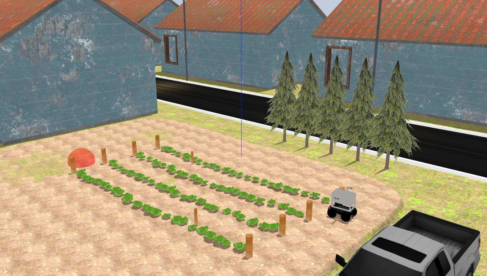

# Task 1: Navigate Farm

## General Description

Agricultural robots must be able to navigate through crops and farmland, which includes autonomously moving through lettuce crop rows on rough terrain. This task involves reaching the end of a row, making a turn, and returning in adjacent rows until the goal location is reached. Teams must develop software to guide the robot through a predefined path within the crop rows, from its starting position to the goal location.

## Task Guidelines
### Launching the Task
In a new terminal, run the following launch file to bring up the robot in Gazebo and RViz:

`roslaunch parc_robot parc_task1.launch`

You should see the display below in Gazebo and RViz respectively. To the right, there's the robot and to the left is the orange-red sphere which represents the goal location.



### Exploring Multiple Routes
* We have prepared two pre-defined routes you can use as you develop your solution with each route having different goal location. The default route is `route1`, but you can select the second route option (`route2`) by passing the argument in the roslaunch command as follows:

`roslaunch parc_robot parc_task1.launch route:=route2`

* We recommend you play around with at least these two routes to ensure your solution is robust to different start locations.

* The goal location can be obtained as a ROS parameter as follows:

```
## Python

goal = rospy.get_param('/goal_location', 10)
x, y, z = goal['x'], goal['y'], goal['z']
```

```
// C++

ros::NodeHandle nh;
std::vector<double> goal{3, 1, 7};
nh.getParam("goal_location", goal)

// goal[0] is 3
// goal[1] is 1
// goal[2] is 7
```

### Preparing your Solution
* Your solution should be prepared as ROS packages to be saved in your solution folder. Create a launch file in your ROS package which runs ALL the code you need in your solution. Name this launch file: `task1_solution.launch`.

* Hence, your solution to Task 1 should be run by calling the following commands:

In one terminal:

`roslaunch parc_robot parc_task1.launch`

Or 

`roslaunch parc_robot parc_task1.launch route:=route2`

> **_NOTE_:** Please wait until the world and robot models finish spawning. This may take longer when running for the first time.

In another terminal:

`roslaunch <your-package-name> task1_solution.launch`

### Robot Sensors

The robot is equipped with different sensors to help you achieve your goal. The sensors are:

* **YDLiDAR:** A LiDAR sensor located at the top of the base of the robot. The YDLiDAR publishes the `/scan` topic.

* **RGB Camera (x2):** Two downward-facing RGB cameras are provided at the left and right side of the robot. These cameras are suspended via an overhang and gives top-view of the farmland. The topics published by these cameras have group names called:
```
/left_camera/
/right_camera/
```

* **ZED 2i Camera:** This is a stereo camera at the front of the robot base. It publishes all the `/zed2/` topics including imu data(`/zed2/imu/data`) and point cloud data(`/zed2/point_cloud/cloud_registered`)

* **GPS:** For localization, we provided a GPS sensor which simulates a GNSS (Global Navigation Satellite System). It publishes the `/gps/` topics.

## Task Rules

* The time limit to complete the task is 4 minutes (240 seconds), there will be bonus point if completed .

* The robot must follow predifined path according to the route spawned as shown above.

* The robot should not step on the crop, a penalty is given if this happens.

* 

Scoring for this task would be based on the following criteria:

| S/N      | Criteria/Metric | Description |
| ----------- | ----------- | ------- |
| 1  | Predefined path | Robot must follow prededfined path.
| 2  | Text            |  |
| 3  | Collisions      | Number of times robot come in contact with crops and other objects in the environment |
| 4  | Completion time | Time from launching the solution to task completion **(Smaller is better)** |