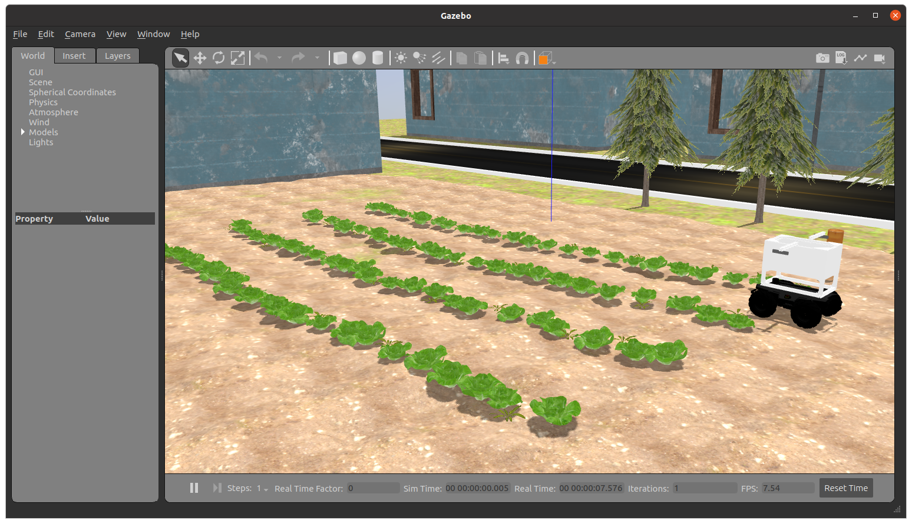
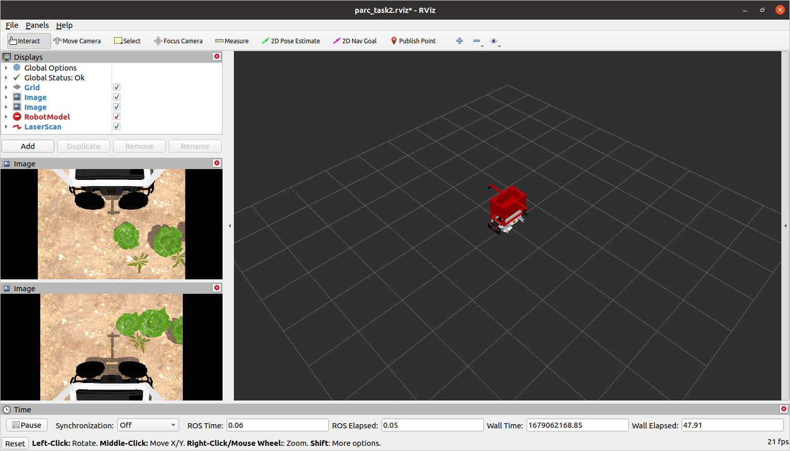

# Task 2: Weed Detection


## General Description

The detection of weeds in fields is crucial for the growth of crops, as weeds can compete for essential resources like water, sunlight, and nutrients, and also act as breeding grounds for pests and diseases. Agricultural robots play a vital role in this regard by navigating through rows of crops to identify and communicate the locations of any weeds present in the field.

!!! warning
    You are expected to complete this task using **MATLAB exclusively**. You can find instructions on how to install MATLAB on your computer [here](/documentation-2023/getting-started-tutorials/introduction-to-matlab/#getting-started). If you need help with creating a ROS node in MATLAB, you can find instructions [here](/documentation-2023/getting-started-tutorials/introduction-to-matlab/#4-ros-integration).

## Task Guidelines

### Launching the Task

In a new terminal, run the following launch file to bring up the robot in Gazebo and RViz:

```bash
roslaunch parc_robot task2.launch
```

You should see the display below in Gazebo and RViz respectively.




Once the route is selected, the robot will promptly start moving. It's worth noting that the robot is equipped with a camera that detects weeds in the field.

To publish the locations of the weeds detected by the robot, you should use the topic `/parc_robot/weed_detection`. The message type for this topic should be `std_msgs/Strings`, which should be in the form of a JSON array string. The array should contain pairs of lon and lat values that represent the GPS coordinates of the weeds in the field. Here's an example of how the array should look like: `[[lon1, lat1], [lon2, lat2], [lon3, lat3], ...]`. You can do this in MATLAB by passing the array to the `jsonencode` function.

!!! note "JSON Array String"
    Spacing between the values in the array is not important and will not affect results. The following are all valid JSON array strings: `[[lon1,lat1],[lon2,lat2],[lon3,lat3],...]`, `[[lon1, lat1], [lon2, lat2], [lon3, lat3], ...]`, `[[lon1,lat1], [lon2,lat2], [lon3,lat3], ...]`, `[[lon1, lat1],[lon2, lat2],[lon3, lat3],...]`, etc.

A new topic called `/parc_robot/robot_status` has been added to publish the current status of the robot. The message type for this topic is `/std_msgs/String`, which indicates whether the robot has started moving along the route or has finished the designated route. The robot status has two possible values: "started" and "finished".

### Exploring multiple routes

We have prepared three pre-defined routes you can use as you develop your solution with each route having a different starting location.

=== "Route 1"
    

=== "Route 2"
    

=== "Route 3"
    


The default route is `route1`, but you can select the second and third route option (`route2` and `route3`) by passing the argument in the roslaunch command as follows: 

```bash
## route2
roslaunch parc_robot task2.launch route:=route2

## route3
roslaunch parc_robot task2.launch route:=route3
```

We recommend you play around with at least these three routes to ensure your solution is robust to different start locations.

### Moving at different speeds

The robot can move at different speeds. The default speed is 0.1 m/s, but you can change the speed by passing the argument in the roslaunch command as follows:

```bash
## 0.1 m/s
roslaunch parc_robot task2.launch

## 0.5 m/s
roslaunch parc_robot task2.launch speed:=0.5

## 1.0 m/s
roslaunch parc_robot task2.launch speed:=1.0
```

We recommend you play around with different speeds to ensure your solution is robust to different speeds.

### Task Expectations

The objective of the task is to drive the robot through a row of crops to identify and communicate the locations of any weeds in the field. When the robot reaches the end of the row, it will come to a stop, and you should publish the weed locations to the `/parc_robot/weed_detection` topic.

It's important to note that real-time publication of weed locations is not necessary. You can publish the locations of the weeds after the robot has stopped moving, which you can monitor through the `/parc_robot/robot_status` topic.

Here is an example MATLAB script to subscribe to the /parc_robot/robot_status topic:

```matlab
% Create a ROS node
rosinit

% Create a subscriber to the /parc_robot/robot_status topic. The callback function is called when a message is received.
sub = rossubscriber('/parc_robot/robot_status', @callbackFcn, 'DataFormat', 'struct');

% Wait for the robot to stop moving
msg = receive(sub, 10);

% Stop the ROS node
rosshutdown
```

After detecting that the robot has stopped moving, you need to publish the GPS coordinates of the weeds in the field to the `/parc_robot/weed_detection` topic. The message should contain a list of longitude and latitude coordinates for each weed location.

Here is an example MATLAB script to publish to the /parc_robot/weed_detection topic:

```matlab
% Create a ROS node
rosinit

% Create a publisher to the /parc_robot/weed_detection topic
pub = rospublisher('/parc_robot/weed_detection', 'std_msgs/String');

% Define the weed locations as a nx2 array of longitude and latitude values
weed_locations = [
    -122.3088, 47.6597;
    -122.3091, 47.6600;  % Note: These are just example values.
    -122.3094, 47.6602   % Your actual code will need to detect the weeds in the field.
    ];

% Convert the weed locations to a JSON array string
json_str = jsonencode(weed_locations);

% Create a String message
msg = rosmessage('std_msgs/String');

% Set the message data to the JSON array string
msg.Data = json_str;

% Publish the message
send(pub, msg);

% Stop the ROS node
rosshutdown
```

### Preparing your submission

Your solution should be prepared as ROS packages to be saved in your solution folder. Create a `scripts` folder in your ROS package which contains ALL the code you need in your solution. Name this MATLAB file: `task2_solution.m`.

Hence, your solution to Task 2 should be run by calling the following commands:

```matlab
matlab -nodesktop -nosplash -r "run('~/catkin_ws/scripts/<your solution folder>/task2_solution.m')"
```

## Task Rules

* You are not allowed to publish to the `/cmd_vel` topic. The robot will be driven through the field by the simulation. You are only allowed to publish to the `/parc_robot/weed_detection` topic.
* You should publish the locations of the weeds in the field to the `/parc_robot/weed_detection` topic not more than 5 seconds after the robot has stopped moving.
* You are only allowed to use MATLAB for this task. You are not allowed to use any other programming language.

## Task Evaluation

Your solution will be evaluated based on the following criteria:

| S/N | Criteria/Metric | Description |
| ----------- | ----------- | ------- |
| 1 | Accuracy | Accuracy is based on how many weeds are correctly detected, within 0.1m of their actual location. Incorrect detections or missed weeds reduce accuracy. Multiple detections within 0.1m of the same actual location count as one accurate detection. |
| 2 | Robustness | We measure the robustness of your solution by evaluating its accuracy across various routes and speeds. The accuracy is given a weight and averaged across different speeds and all three routes to determine the overall robustness of your solution. |
| 3 | Precision | Precision is evaluated based on the number of weeds detected within 0.1m of their actual location by your solution. False negatives incur higher penalties in this evaluation, indicating that missing weeds is considered more detrimental than detecting weeds that are not actually present. |

