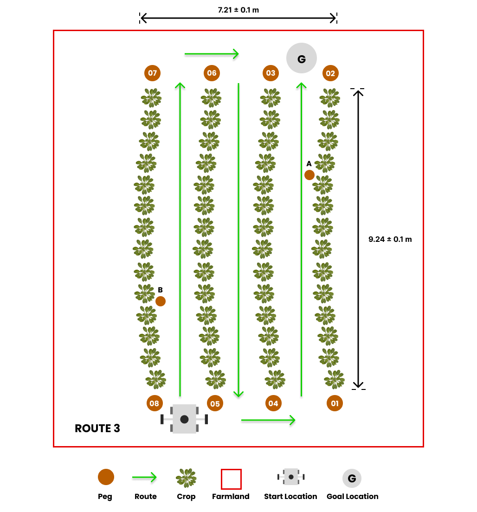

# Task 2: Weed Detection

## General Description

Agricultural robots have a crucial role in detecting weeds in fields, as they can impede the growth of crops by competing for essential resources such as water, sunlight, and nutrients, and also serve as breeding grounds for pests and diseases. The robot will navigate through rows of crops, and the objective is to identify and communicate the location of any weeds present in the field.

## Task Guidelines

### Launching the Task

In a new terminal, run the following launch file to bring up the robot in Gazebo and RViz:

```bash
roslaunch parc_robot parc_task2.launch
```

Upon selection of the route, the robot will promptly commence movement. Notably, the robot is equipped with a camera, which serves the purpose of detecting weeds in the field.

An additional topic has been created under the name `/parc/weed_detection`, responsible for publishing the location of weeds in the field. The message type for this topic is `/parc_msgs/WeedDetection`. Within the WeedDetection message, a list of Weed messages can be found, with each containing the GPS coordinates of the weed in the field. The Weed message also comprises a confidence field, indicating the level of certainty the robot has that the weed is indeed a weed. This field ranges from 0 to 1, with a value of 1 indicating absolute confidence and a value of 0 denoting absolute uncertainty.

Furthermore, a new topic has been introduced as `/parc/robot_status`, which serves the purpose of publishing the status of the robot. The message type for this topic is `parc_msgs/RobotStatus`. The RobotStatus message contains a status field, represented as a string that informs of the robot's current status. The possible values for this field are `started` and `finished`, where `started` indicates that the robot has begun moving along the route, and `finished` indicates that it has completed the designated route.

### Exploring multiple routes

We have prepared three pre-defined routes you can use as you develop your solution with each route having different goal location.

=== "Route 1"
    

=== "Route 2"
    

=== "Route 3"
    


The default route is `route1`, but you can select the second and third route option (`route2` and `route3`) by passing the argument in the roslaunch command as follows: 

```bash
## route2
roslaunch parc_robot parc_task2.launch route:=route2

## route3
roslaunch parc_robot parc_task2.launch route:=route3
```

We recommend you play around with at least these three routes to ensure your solution is robust to different start locations.

### Moving at different speeds

The robot can move at different speeds. The default speed is 0.1 m/s, but you can change the speed by passing the argument in the roslaunch command as follows:

```bash
## 0.1 m/s
roslaunch parc_robot parc_task2.launch

## 0.5 m/s
roslaunch parc_robot parc_task2.launch speed:=0.5

## 1.0 m/s
roslaunch parc_robot parc_task2.launch speed:=1.0
```

We recommend you play around with differnt speeds to ensure your solution is robust to different speeds.

### Task Expectations

The task at hand involves driving the robot through a row of crops with the objective of identifying and communicating the location of any weeds present in the field. Once the robot reaches the end of the row, it will come to a stop. At this point, you should publish the locations of the weeds to the `/parc/weed_detection` topic.

It is worth noting that real-time publication of weed locations is not required. You can publish the locations of the weeds in the field after the robot has stopped moving. You can determine when the robot has stopped moving by monitoring the `/parc/robot_status` topic.

Upon detecting that the robot has stopped moving, it is then necessary to publish the locations of the weeds to the `/parc/weed_detection` topic. Within the WeedDetection message, you can find a list of Weed messages, with each message containing the GPS coordinates of the weed in the field. Additionally, the Weed message includes a confidence field, indicating the robot's level of certainty that the identified weed is indeed a weed. The confidence value ranges from 0 to 1, where a value of 1 indicates absolute confidence, and a value of 0 denotes absolute uncertainty.

### Preparing your submission

Your solution should be prepared as ROS packages to be saved in your solution folder. Create a launch file in your ROS package which runs ALL the code you need in your solution. Name this launch file: task2_solution.launch.

Hence, your solution to Task 2 should be run by calling the following commands:

```bash
roslaunch <your_solution_package> task2_solution.launch
```

## Task Rules

* You are not allowed to publish to the `/parc/cmd_vel` topic. The robot will be driven through the field by the simulation. You are only allowed to publish to the `/parc/weed_detection` topic.
* You should publish the locations of the weeds in the field to the `/parc/weed_detection` topic not more than 5 seconds after the robot has stopped moving.

## Task Evaluation

Your solution will be evaluated based on the following criteria:

| S/N      | Criteria/Metric | Description |
| ----------- | ----------- | ------- |
| 1      | Accuracy       | The accuracy of your solution is measured by the number of weeds that your solution detects. The more weeds your solution detects, the higher your accuracy score. |
| 2   | Speed        | The speed of your solution is measured by the time it takes for your solution to detect all the weeds in the field. The faster your solution detects all the weeds in the field, the higher your speed score. |

