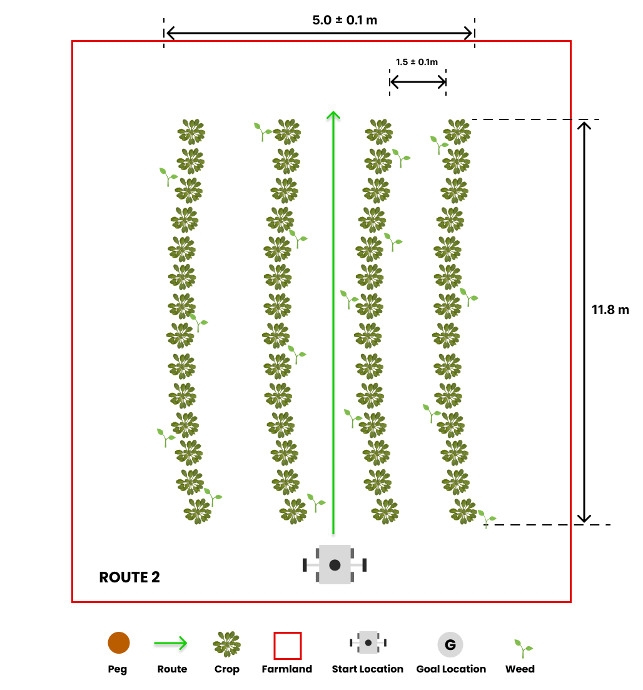

# Task 2: Weed Detection

## General Description

The detection of weeds in fields is crucial for the growth of crops, as weeds can compete for essential resources like water, sunlight, and nutrients, and also act as breeding grounds for pests and diseases. Agricultural robots play a vital role in this regard by navigating through rows of crops to identify and communicate the locations of any weeds present in the field.

!!! warning
    You are expected to complete this task using MATLAB exclusively. You can find instructions on how to install MATLAB on your computer [here](/documentation-2023/getting-started-tutorials/introduction-to-matlab/#getting-started).

## Task Guidelines

### Launching the Task

In a new terminal, run the following launch file to bring up the robot in Gazebo and RViz:

```bash
roslaunch parc_robot parc_task2.launch
```

Once the route is selected, the robot will promptly start moving. It's worth noting that the robot is equipped with a camera that detects weeds in the field.

A new topic called `/parc_robot/weed_detection` has been created to publish the weed locations in the field. The message type for this topic is `/parc_robot/WeedDetection`, which includes a list of Weed messages containing the GPS coordinates of each weed. Additionally, each Weed message has a confidence field that indicates the level of certainty that the weed is indeed a weed, with values ranging from 0 to 1. A confidence value of 1 represents absolute certainty, while a value of 0 represents absolute uncertainty.

Moreover, a new topic has been introduced as `/parc_robot/robot_status` to publish the robot's status. The message type for this topic is `/parc_robot/RobotStatus`, and the RobotStatus message contains a status field represented as a string that informs the robot's current status. The status field can have two possible values: started, indicating that the robot has started moving along the route, and finished, indicating that it has completed the designated route.

### Exploring multiple routes

We have prepared three pre-defined routes you can use as you develop your solution with each route having a different starting location.

=== "Route 1"
    

=== "Route 2"
    

=== "Route 3"
    


The default route is `route1`, but you can select the second and third route option (`route2` and `route3`) by passing the argument in the roslaunch command as follows: 

```bash
## route2
roslaunch parc_robot parc_task2.launch route:=route2

## route3
roslaunch parc_robot parc_task2.launch route:=route3
```

We recommend you play around with at least these three routes to ensure your solution is robust to different start locations.

### Moving at different speeds

The robot can move at different speeds. The default speed is 0.1 m/s, but you can change the speed by passing the argument in the roslaunch command as follows:

```bash
## 0.1 m/s
roslaunch parc_robot parc_task2.launch

## 0.5 m/s
roslaunch parc_robot parc_task2.launch speed:=0.5

## 1.0 m/s
roslaunch parc_robot parc_task2.launch speed:=1.0
```

We recommend you play around with differnt speeds to ensure your solution is robust to different speeds.

### Task Expectations

The objective of the task is to drive the robot through a row of crops to identify and communicate the locations of any weeds in the field. When the robot reaches the end of the row, it will come to a stop, and you should publish the weed locations to the `/parc_robot/weed_detection` topic.

It's important to note that real-time publication of weed locations is not necessary. You can publish the locations of the weeds after the robot has stopped moving, which you can monitor through the `/parc_robot/robot_status` topic.

Once you detect that the robot has stopped moving, you must publish the weed locations to the `/parc_robot/weed_detection` topic. The WeedDetection message contains a list of Weed messages, each with the GPS coordinates of a weed in the field. The Weed message also includes a confidence field, which shows the robot's certainty that the identified weed is a weed. The confidence value ranges from 0 to 1, where 1 represents absolute confidence, and 0 denotes absolute uncertainty.

### Preparing your submission

Your solution should be prepared as ROS packages to be saved in your solution folder. Create a launch file in your ROS package which runs ALL the code you need in your solution. Name this launch file: task2_solution.launch.

Hence, your solution to Task 2 should be run by calling the following commands:

```bash
roslaunch <your_solution_package> task2_solution.launch
```

## Task Rules

* You are not allowed to publish to the `/cmd_vel` topic. The robot will be driven through the field by the simulation. You are only allowed to publish to the `/parc_robot/weed_detection` topic.
* You should publish the locations of the weeds in the field to the `/parc_robot/weed_detection` topic not more than 5 seconds after the robot has stopped moving.

## Task Evaluation

Your solution will be evaluated based on the following criteria:

| S/N | Criteria/Metric | Description |
| ----------- | ----------- | ------- |
| 1 | Accuracy | Accuracy is based on how many weeds are correctly detected, within 0.1m of their actual location. Incorrect detections or missed weeds reduce accuracy. Multiple detections within 0.1m of the same actual location count as one accurate detection. |
| 2 | Robustness | We measure the robustness of your solution by evaluating its accuracy across various routes and speeds. The accuracy is given a weight and averaged across different speeds and all three routes to determine the overall robustness of your solution. |
| 3 | Precision | Precision is evaluated based on the number of weeds detected within 0.1m of their actual location by your solution. False negatives incur higher penalties in this evaluation, indicating that missing weeds is considered more detrimental than detecting weeds that are not actually present. |

