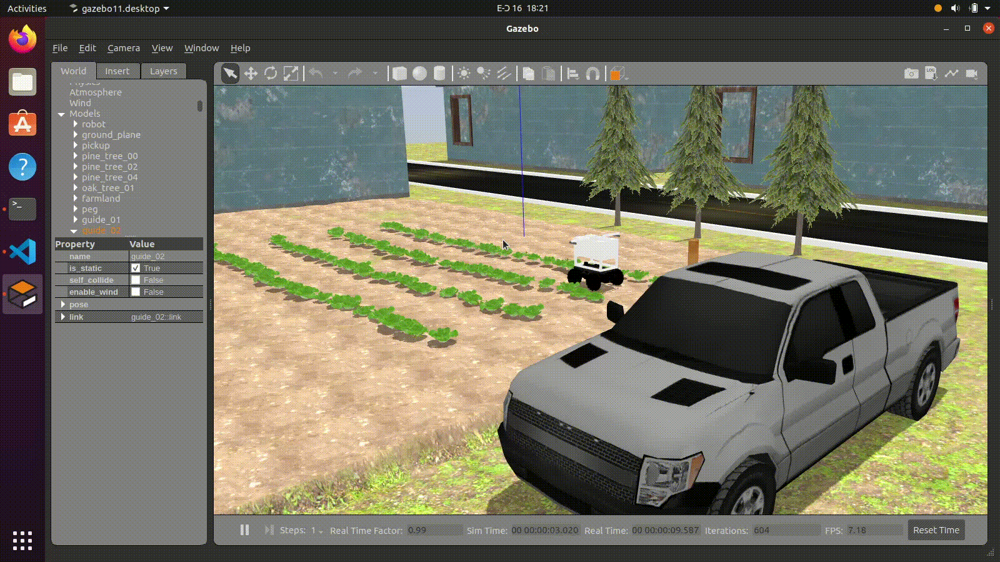

# En passant avec ROS

Le [Robot Operating System](https://www.ros.org/about-ros/) (ROS) est un framework flexible pour écrire un logiciel robot. Il s'agit d'une collection d'outils, de bibliothèques et de conventions qui visent à simplifier la tâche de créer un comportement de robot complexe et robuste sur une grande variété de plateformes robotiques.

Nous avons prévu cette concurrence autour de ROS en raison de ses fonctionnalités ainsi que de son utilisation généralisée dans la recherche et l'industrie en robotique.

Pour commencer avec ROS (si vous êtes un débutant), nous vous recommandons de suivre les didacticiels du "niveau débutant" dans les [tutoriels ROS officiels](http://wiki.ros.org/ros/tutorials). Assurez-vous de terminer au moins ce qui suit:

* [Chapitre 5](http://wiki.ros.org/ros/tutorials/UnderstandingNodes) (ROS NODES): * "Ce didacticiel présente les concepts de graphiques ROS et discute de l'utilisation des outils de ligne de commande Roscore, Rosnode et Rosrun" *
* [Chapitre 6](http://wiki.ros.org/ros/tutorials/UnderstandingTopics) (ROS TRICMES): * "Ce didacticiel présente des sujets ROS ainsi que l'utilisation des outils de commande Rostopic et RQT_PLOT." *
* [Chapitre 12](http://wiki.ros.org/ros/tutorials/writingpublishersubscriber%28python%29) (écrivant un éditeur simple et abonné en python)
* Comprendre les [outils de base fournis par ROS](https://www.ros.org/core-components/), y compris Rviz, RQT_Graph, Gazebo, etc.

Après avoir terminé les tutoriels requis répertoriés ci-dessus, vous pouvez démarrer [Configuration de l'espace de travail](../setting-up-your-workspace).

En supposant l'espace de travail à `~/catkin_ws/` tel que complété à partir des étapes effectuées dans [Configuration de votre espace de travail](../setting-up-your-workspace),
Cela devrait être votre structure de dossier jusqu'à présent.

```
~/catkin_ws/
├── build/
│   ├── .
│   └── .
├── devel/
│   ├── .
│   └── .
└── src/
    ├── CMakeLists.txt
    └── parc-engineers-league/
        ├── parc-robot/
        │   ├── .
        │   ├── .
        │   ├── CMakeLists.txt
        │   └── package.xml
        ├── .
        └── .
```

La première étape consiste à créer votre dossier de solution dans `~/catkin_ws/src/`, nous pouvons l'appeler `parc_solutions` par exemple.
```shell
mkdir ~/catkin_ws/src/parc_solutions
```
Entrez dans le dossier,
```shell
cd ~/catkin_ws/src/parc_solutions
```

Et ici, vous pouvez créer un nouveau package ROS appelé `test_publisher` (par exemple) en exécutant la commande ci-dessous,
```shell
catkin_create_pkg test_publisher roscpp rospy std_msgs geometry_msgs
```

## Déplacer le robot programmatique

[Configuration de votre espace de travail](../setting-up-your-workspace) a déjà montré comment contrôler le robot avec le clavier à l'aide de `Teleoperation`

Mais ce guide vous aidera à déplacer le robot en publiant des commandes sur le sujet `/ cmd_vel` par programme à l'aide d'un script python.


Pour ce faire, créez un fichier, `robot_publisher.py` dans le dossier` scripts` dans votre package ROS (par exemple `test_publisher`) et le rendre exécutable.

=== "MATLAB"
    ```shell
    mkdir test_publisher/scripts
    touch test_publisher/scripts/robot_publisher.m
    ```
=== "Python"
    ```shell
    mkdir test_publisher/scripts
    touch test_publisher/scripts/robot_publisher.py
    chmod +x test_publisher/scripts/robot_publisher.py
    ```

=== "C++"
    ```shell
    mkdir test_publisher/src
    touch test_publisher/src/robot_publisher.cpp
    ```

!!! note "Note MATLAB"
    Assurez-vous que vous disposez de la [Matlab Ros Toolbox](https://www.mathworks.com/help/ros/ug/install-the-matlab-bos-toolbox.html) installé et configuré. Assurez-vous également d'ajouter Test_Publisher / Scripts / sur le chemin MATLAB. Les instructions pour cela peuvent être trouvées dans [la documentation MATLAB](https://www.mathworks.com/help/matlab/ref/addpath.html).

!!! note "Note Python"
    Vous devez modifier l'autorisation du fichier en exécutable pour pouvoir s'exécuter (comme fait dans la dernière commande illustrée ci-dessus).

Ouvrez maintenant le fichier et copiez et collez le code suivant à l'intérieur:

=== "MATLAB"
    ```matlab
    function robot_publisher()
      % Script pour déplacer le robot
      % Initialiser le nœud ROS
      rosinit('localhost');
      
      % Créer un éditeur qui peut «parler» au robot et lui dire de bouger
      pub = rospublisher('/cmd_vel', 'geometry_msgs/Twist');
      
      % Créer un message de torsion et ajouter des valeurs linéaires X et Z angulaires
      move_cmd = rosmessage(pub);
      
      % Définir le taux de publication à 10 Hz
      rate = rosrate(10);
      
      %%%%%%%%%% Se déplacer tout droit %%%%%%%%%%
      disp("Se déplaçant tout droit");
      move_cmd.Linear.X = 0.5;           % se déplacer en axe x à 0,5 m / s
      move_cmd.Angular.Z = 0.0;
      
      % Pour les 4 secondes suivantes, publier les commandes cmd_vel MOVE
      now = rostime('now');
      while rostime('now') - now < rosduration(4)
          send(pub, move_cmd);          % publier sur robot
          waitfor(rate);
      end
      
      %%%%%%%%%% Rotatif dans le sens intérieure %%%%%%%%%%
      disp("Tournante");
      move_cmd.Linear.X = 0.0;
      move_cmd.Angular.Z = 0.3;         % tourner à 0,3 rad / sec
      
      % Pour les 3 prochaines secondes, publiez les commandes cmd_vel move
      now = rostime('now');
      while rostime('now') - now < rosduration(3)
          send(pub, move_cmd);          % publier sur robot
          waitfor(rate);
      end
      
      %%%%%%%%%% Arrêt %%%%%%%%%%
      disp("Arrêt");
      move_cmd.Linear.X = 0.0;
      move_cmd.Angular.Z = 0.0;         % Donner à la fois zéro arrêtera le robot
      
      % Pour les 1 secondes suivantes, publier les commandes cmd_vel MOVE
      now = rostime('now');
      while rostime('now') - now < rosduration(1)
          send(pub, move_cmd);          % publier sur robot
          waitfor(rate);
      end
      
      disp("Sortie");
      
      % Nœud ROS d'arrêt
      rosshutdown;
    end
    ```
=== "Python"
    ```python
    #!/usr/bin/env python
    """
    Script pour déplacer le robot
    """
    import rospy
    from geometry_msgs.msg import Twist
    import time


    def move_robot():
        rospy.init_node('robot_publisher', anonymous=True)
        # Créez un éditeur qui peut "parler" à Robot et lui dire de bouger
        pub = rospy.Publisher('/cmd_vel', Twist, queue_size=10)

        # Fixer le taux de publication à 10 Hz
        rate = rospy.Rate(10)

        # Créez un message de torsion et ajoutez des valeurs linéaires X et Z angulaires
        move_cmd = Twist()

        ######## Se déplacer tout droit ########
        print("Se déplaçant tout droit")
        move_cmd.linear.x = 0.5             # se déplacer en axe x à 0,5 m / s
        move_cmd.angular.z = 0.0

        now = time.time()
        # Pour les 4 secondes suivantes, publier les commandes cmd_vel move
        while time.time() - now < 4:
            pub.publish(move_cmd)           # publier sur robot
            rate.sleep()

        ######## Rotatif dans le sens intérieure ########
        print("Tournante")
        move_cmd.linear.x = 0.0
        move_cmd.angular.z = 0.3            # tourner à 0,3 rad / sec

        now = time.time()
        # Pour les 3 prochaines secondes, publiez les commandes cmd_vel move
        while time.time() - now < 3:
            pub.publish(move_cmd)           # publier sur robot
            rate.sleep()

        ######## Arrêt ########
        print("Arrêt")
        move_cmd.linear.x = 0.0
        move_cmd.angular.z = 0.0            # Donner à la fois zéro arrêtera le robot

        now = time.time()
        # Pour les 1 secondes suivantes, publier les commandes CMD_VEL MOVE
        while time.time() - now < 1:
            pub.publish(move_cmd)           # publier sur robot
            rate.sleep()

        print("Sortie")


    if __name__ == '__main__':
        try:
            move_robot()
        except rospy.ROSInterruptException:
            pass
    ```

=== "C++"
    ```cpp
    #include <ros/ros.h>
    #include <geometry_msgs/Twist.h>
    #include <ctime>

    void move_robot()
    {
        ros::NodeHandle nh;
        // Créez un éditeur qui peut "parler" à Robot et lui dire de bouger
        ros::Publisher pub = nh.advertise<geometry_msgs::Twist>("/cmd_vel", 10);

        // Fixer le taux de publication à 10 Hz
        ros::Rate rate(10);

        // Créez un message de torsion et ajoutez des valeurs linéaires X et Z angulaires
        geometry_msgs::Twist move_cmd;

        //////////// Se déplacer tout droit ////////////
        ROS_INFO("Se déplaçant tout droit");
        move_cmd.linear.x = 0.5;            // se déplacer en axe x à 0,5 m / s
        move_cmd.angular.z = 0.0;

        time_t now = time(0);
        // Pour les 4 secondes suivantes, publier les commandes cmd_vel move
        while (time(0) - now < 4)
        {
            pub.publish(move_cmd);          // publier sur robot
            rate.sleep();
        }

        //////////// Rotatif dans le sens intérieure ////////////
        ROS_INFO("Tournante");
        move_cmd.linear.x = 0.0;
        move_cmd.angular.z = 0.3;           // tourner à 0,3 rad / sec

        now = time(0);
        // Pour les 3 prochaines secondes, publiez les commandes cmd_vel move
        while (time(0) - now < 3)
        {
            pub.publish(move_cmd);          // publier sur robot
            rate.sleep();
        }

        //////////// Arrêt ////////////
        ROS_INFO("Arrêt");
        move_cmd.linear.x = 0.0;
        move_cmd.angular.z = 0.0;           // Donner à la fois zéro arrêtera le robot

        now = time(0);
        // Pour les 1 secondes suivantes, publier les commandes CMD_VEL MOVE
        while (time(0) - now < 1)
        {
            pub.publish(move_cmd);          // publier sur robot
            rate.sleep();
        }

        ROS_INFO("Sortie");
    }

    int main(int argc, char **argv)
    {
        ros::init(argc, argv, "robot_publisher");
        try
        {
            move_robot();
        }
        catch (ros::Exception &e)
        {
            ROS_ERROR("Exception encountered: %s", e.what());
            return 1;
        }

        return 0;
    }
    ```

Ouvrez maintenant le fichier et copiez et collez le code suivant à l'intérieur:

## compiler et courir

Pour C ++, nous devons mettre à jour le fichier `CMakeLists.txt` pour inclure notre nouveau programme. Ajoutez la ligne suivante au fichier `CMakeLists.txt`:

```cmake
add_executable(robot_publisher src/robot_publisher.cpp)
target_link_libraries(robot_publisher ${catkin_LIBRARIES})
```

Puis exécutez la commande suivante pour compiler le code:

```shell
cd ~/catkin_ws
catkin_make
```

Pour le voir fonctionner, exécutez d'abord le robot en simulation en exécutant la commande suivante dans un terminal

```shell
source ~/catkin_ws/devel/setup.bash
roslaunch parc-robot parc_task2.launch
```

Et exécutez la commande suivante dans un autre terminal pour exécuter ce nouveau programme:
=== "MATLAB"
    Dans la fenêtre de commande MATLAB, exécutez la commande suivante:
    ```matlab
    rosinit
    robot_publisher
    ```

=== "Python"
    ```shell
    source ~/catkin_ws/devel/setup.bash
    rosrun test_publisher robot_publisher.py
    ```
=== "C++"
    ```shell
    source ~/catkin_ws/devel/setup.bash
    rosrun test_publisher robot_publisher
    ```

Si vous avez bien configuré, vous devriez voir le robot se déplacer dans Gazebo comme ci-dessous:



## Ressources supplémentaires

Si vous souhaitez en savoir plus sur ROS, vous pouvez consulter les ressources suivantes:

- [Tutoriels ROS](http://wiki.ros.org/ROS/Tutorials){target=_blank} - Tutoriels officiels ROS
- [Liste de lecture YouTube ROS Tutorial YouTube](https://www.youtube.com/playlist?list=PLLSegLrePWgIbIrA4iehUQ-impvIXdd9Q){target=_blank} - Liste de lecture YouTube des tutoriels ROS. C'est une bonne ressource si vous préférez apprendre en regardant des vidéos.
