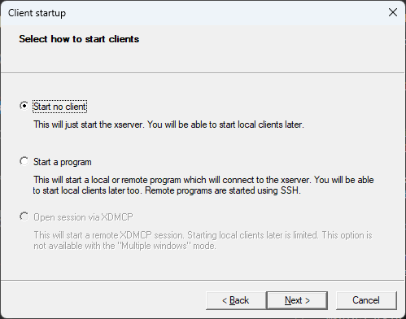
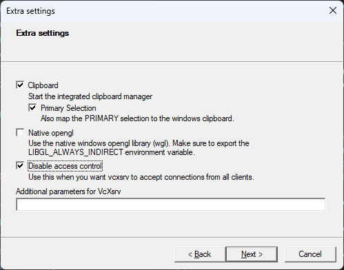
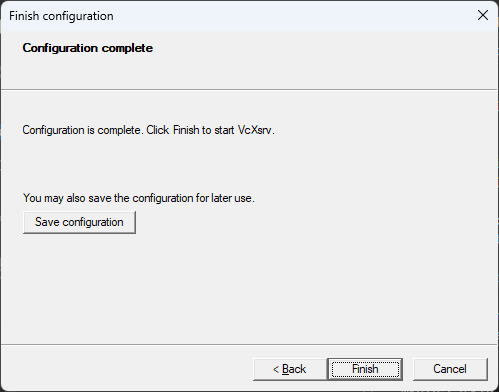
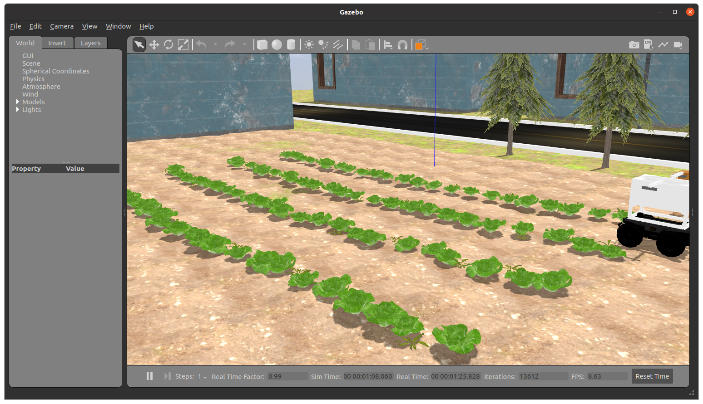
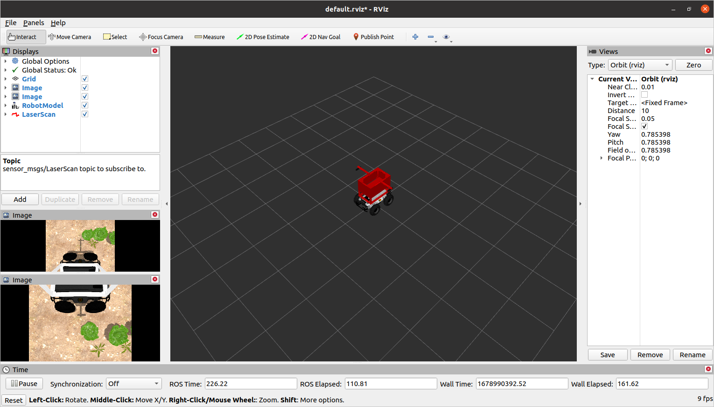
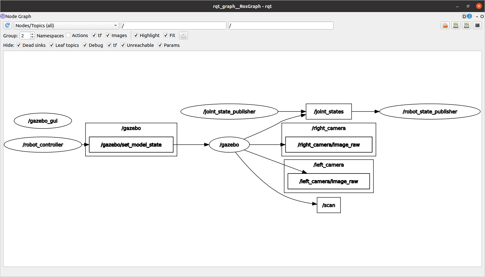

# Configuration de votre espace de travail avec Docker sur Windows

Ce guide vous guidera tout au long du processus de mise en place d'un espace de travail ROS avec Docker, qui vous permettra de développer et de tester facilement vos projets ROS dans un environnement conteneurisé. Nous couvrirons également comment connecter VS Code au conteneur Docker et comment utiliser X11 pour exécuter les applications GUI Docker.

## Conditions préalables
Avant de commencer par les étapes ci-dessous, assurez-vous que vous avez ce qui suit:

* Docker Desktop pour Windows installé et exécuté
* Code Visual Studio (Code vs) installé

## Étape 1: Installer VcXsrv

1. Téléchargez et installez [VcXSrv](https://sourceforge.net/projects/vcxsrv/){:target=_blank} sur votre ordinateur.
2. Installez VcXSrv en exécutant l'installateur et en suivant les invites.
3. Une fois l'installation terminée, ouvrez le VCXSRV en cliquant sur le menu Démarrer et en tapant `XLaunch`.
4. Dans la fenêtre Xlaunch, sélectionnez l'option `multiple Windows` et cliquez sur `Next`.
    
5. Dans la fenêtre suivante, sélectionnez l'option `Démarrez pas de client` et cliquez sur `Next`.
    
6. Dans la fenêtre suivante, sélectionnez l'option `Clips de presse` et cliquez sur `Next`. Désélectionnez l'option `native OpenGL` et sélectionnez l'option `Désactiver le contrôle d'accès`.
    
7. Dans la fenêtre suivante, cliquez sur `Finish`.
    

## Étape 2: Création du dossier principal et `docker-compose.yml`

1. Créez un nouveau dossier dans votre emplacement préféré et nommez-le comme vous le souhaitez.
2. À l'intérieur du dossier nouvellement créé, créez un espace de travail ROS en exécutant la commande suivante dans PowerShell:

    ```shell
    mkdir catkin_ws/src
    ```

3. Ensuite, créez un fichier `docker-compose.yml` dans le dossier principal. Ce fichier contiendra la configuration de notre conteneur Docker ROS. Ouvrez le fichier dans votre éditeur préféré et ajoutez les lignes suivantes:

    ```yaml
    version: '3.8'
    services:
      ros:
        image: osrf/ros:noetic-desktop-full
        environment:
          - DISPLAY=host.docker.internal:0.0
          - ROS_HOSTNAME=ros
          - ROS_MASTER_URI=http://ros:11311
        volumes:
          - ./catkin_ws:/catkin_ws
        ports:
          - "11311:11311"
        command: roscore
    ```
    Cette configuration tirera l'image complète ROS Noetic Desktop, si elle n'existe pas déjà et la configure pour la prise en charge du serveur X11. Il montera également le dossier `catkin_ws` à l'intérieur du conteneur et démarrera la commande `roscore` au début du conteneur.

4. Enregistrez le fichier `docker-compose.yml` et fermez votre éditeur.

## Étape 3: Construire le conteneur Docker

1. Ouvrez une nouvelle fenêtre de terminal et accédez au dossier principal que vous avez créé plus tôt.

2. Exécutez la commande suivante pour construire le conteneur Docker:

    ```shell
    docker compose up -d
    ```

3. Une fois le conteneur construit, vous pouvez vérifier qu'il s'exécute en exécutant la commande suivante:

    ```shell
    docker ps
    ```

    Vous devriez voir la sortie suivante:

    ```shell
    CONTAINER ID   IMAGE                          COMMAND                  CREATED          STATUS          PORTS                    NAMES
    db7df0798d9b   osrf/ros:noetic-desktop-full   "/ros_entrypoint.sh …"   20 seconds ago   Up 19 seconds    0.0.0.0:11311->11311/tcp   parc-ros-docker-ros-1
    ```

## Étape 4: Ouverture d'un terminal dans le conteneur Docker

1. Pour ouvrir un terminal dans le conteneur Docker, exécutez la commande suivante:

    ```shell
    docker exec -it parc-ros-docker-ros-1 bash
    ```
    où `parc-ros-docker-ros-1` est le nom du conteneur. Vous pouvez trouver le nom du conteneur en exécutant la commande `docker ps`.

2. Une fois le terminal ouvert, vous pouvez vérifier que vous êtes dans le conteneur en exécutant la commande suivante:

    ```shell
    echo $ROS_DISTRO
    ```

    Vous devriez voir la sortie suivante:

    ```shell
    noetic
    ```

## Étape 5: Configuration de l'espace de travail ROS

1. Source l'environnement ROS:

    ```shell
    source /opt/ros/noetic/setup.bash
    ```

2. Accédez au dossier `catkin_ws`:

    ```shell
    cd /catkin_ws
    mkdir src
    cd src
    catkin_init_workspace
    ```

3. Initialisez l'espace de travail:

    ```shell
    cd ..
    catkin_make
    ```

4. Source l'espace de travail:

    ```shell
    source devel/setup.bash
    ```

5. Configurez bash pour trouver automatiquement l'espace de travail:

    ```shell
    echo "source /catkin_ws/devel/setup.bash" >> ~/.bashrc
    echo "source /opt/ros/noetic/setup.bash" >> ~/.bashrc
    ```

## Étape 6: Cloner le référentiel

Dans le même terminal (ou dans un nouveau), copiez et collez ce qui suit:
```sh
cd ~/catkin_ws/src
git clone --recurse-submodules https://github.com/PARC-Robotics/PARC-Engineers-League.git
```
Ou si vous avez déjà cloné le référentiel sans sous-modules, exécutez la commande `git submodule update --init --recursive` pour les mettre à jour.

## Étape 7: Installer des dépendances

Dans le même terminal (ou dans un nouveau), copiez et collez ce qui suit:
```sh
cd ~/catkin_ws
sudo apt update
rosdep install --from-paths ./src --ignore-src -y
```

## Étape 8: Compiler les forfaits
```sh
cd ~/catkin_ws
catkin_make
source ~/catkin_ws/devel/setup.bash
```


**NOTE:** Il y a un problème connu lors de la compilation, ` Intel RealSense SDK 2.0 is missing`  
Pour résoudre, mettez à jour le fichier `realsense-ros/realsense_camera/CMakeLists.txt`, ligne: 43 à `find_package(realsense2 2.36.0) `
c'est-à-dire rétrograder la version requise de `realsense2` à` 2.36.0`

## Étape 9: Configurer l'environnement ROS
Sournez votre environnement ROS une fois de plus en exécutant cette commande:

```sh
source ~/.bashrc
```


## Étape 10: Installation de test

Si vous avez terminé les tâches précédentes avec succès, vous devriez être en mesure d'exécuter cette commande de lancement ROS et de voir le simulateur de gazebo et le simulateur RViz ouvert avec l'écran suivant:
```sh
roslaunch parc-robot task1.launch
```

Gazebo Simulator window



RViz window


Si vous exécutez la commande suivante dans un nouveau terminal,
```
rqt_graph
```
Vous verrez un écran comme ceci:



You need to `publish`/write to the `topic` `/cmd_vel` to move the robot.
The following guide will help you control the robot using keyboard. Once you have tested that, you can follow the [understanding-ros](../getting-started-with-ros) guide to write a python program to control the robot.
Vous devez `publier`/ écrire sur le `sujet` `/cmd_vel` pour déplacer le robot.
Le guide suivant vous aidera à contrôler le robot à l'aide du clavier. Une fois que vous avez testé cela, vous pouvez suivre le guide [understanding-ros](../getting-started-with-ros) pour écrire un programme Python pour contrôler le robot.

## Étape 11: Contrôlant le robot à l'aide du clavier
Exécutez la commande suivante dans un nouveau terminal
```sh
source ~/catkin_ws/devel/setup.bash
roslaunch parc-robot teleop.launch
```

Maintenant, en gardant le deuxième terminal sur le dessus (teleop.launch), appuyez sur «Je» pour faire avancer le robot, vous pouvez voir le robot se déplacer sous Windows «Rviz» et «Gazebo».
Vous pouvez utiliser les touches ci-dessous pour déplacer le robot et la touche `k` pour arrêter le mouvement.
```sh
Se déplacer:
   u    i    o
   j    k    l
   m    ,    .
```

## Étape 12: Développer à l'intérieur du conteneur avec VS Code

1. Installez les [Conteneurs Dev](https://marketplace.visualstudio.com/items?itemname=ms-vscode-remote.remote-contrainers){:target=_blank} Extension dans vscode.

2. Cliquez sur l'icône verte dans le coin inférieur gauche de la fenêtre VS Code et sélectionnez `OUVERSEZ DU DOSDER DANS LE CONTUTER ...`.

3. Sélectionnez le dossier `catkin_ws`.

4. VScode ouvrira désormais le dossier `catkin_ws` à l'intérieur du conteneur.

5. Vous pouvez maintenant utiliser VScode pour modifier les fichiers dans le dossier `catkin_ws`.

Alternativement, comme nous avons déjà créé un volume pour le dossier `catkin_ws`, vous pouvez également utiliser votre éditeur préféré pour modifier des fichiers dans le dossier `catkin_ws` sur votre machine hôte. Les modifications seront reflétées à l'intérieur du conteneur. L'avantage de l'utilisation de VScode dans le conteneur est que vous pouvez utiliser le terminal intégré pour exécuter les commandes à l'intérieur du conteneur.
