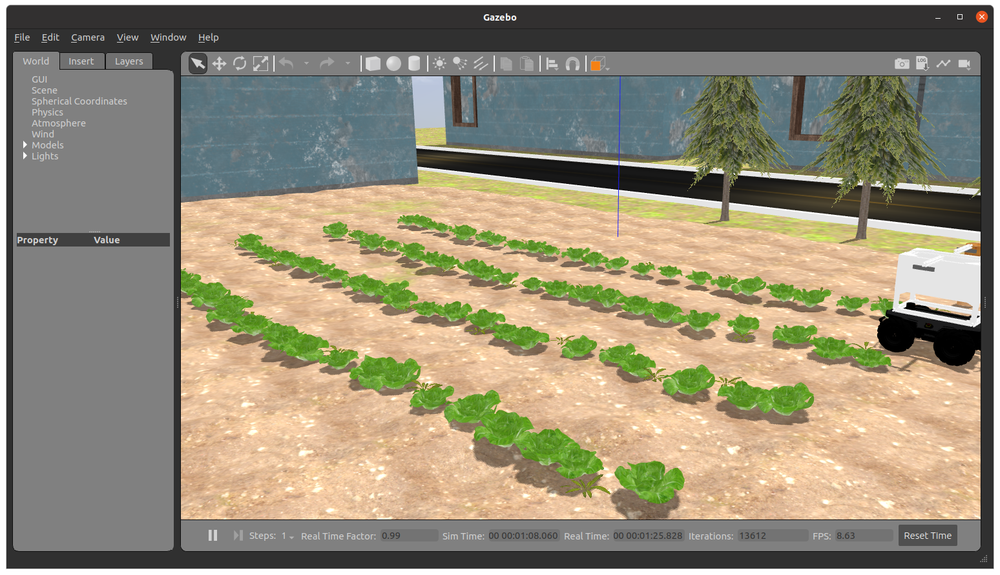
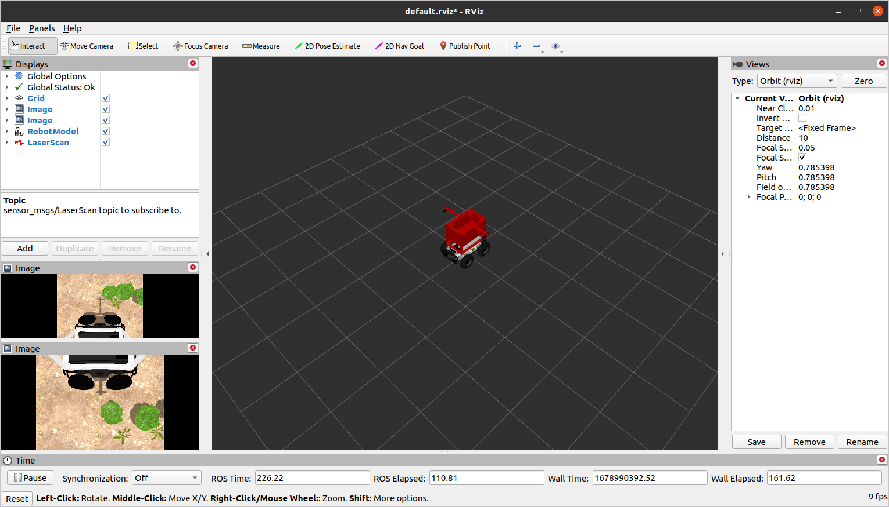
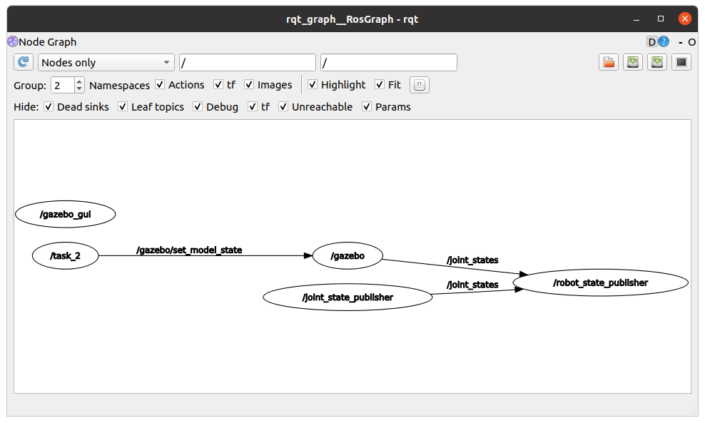

# Comment configurer votre espace de travail


Dans ce tutoriel, vous définissez votre configuration d'un répertoire sur votre PC compatible ROS en tant qu'espace de travail pour le développement et installez les packages ROS de compétition. Veuillez suivre attentivement les instructions ci-dessous.

!!! note
     Cela ne peut être terminé qu'après avoir configuré votre PC (en suivant le tutoriel précédent)

### Configuration de l'espace de travail ROS

<! - Tout d'abord, nous créons un nouveau répertoire dans votre répertoire personnel appelé `Catkin_ws` avec un sous-répertoire` src`. Ensuite, nous initialisons le répertoire en tant qu'espace de travail Catkin. ->

Ouvrez un nouveau terminal sur votre PC, puis copiez et collez la ligne suivante à la fois:
```sh
mkdir -p ~/catkin_ws/src
cd ~/catkin_ws/src
catkin_init_workspace
```


### clone le référentiel

Dans le même terminal (ou dans un nouveau), copiez et collez ce qui suit:
```sh
cd ~/catkin_ws/src
git clone --recurse-submodules https://github.com/PARC-Robotics/PARC-Engineers-League.git
```
Ou si vous avez déjà cloné le référentiel sans sous-modules, exécutez la commande `git submodule update --init --recursive` pour les mettre à jour.

### Installer les dépendances

Dans le même terminal (ou dans un nouveau), copiez et collez ce qui suit:
```sh
cd ~/catkin_ws
sudo apt update
rosdep install --from-paths ./src --ignore-src -y
```

### Packages de compilation
```sh
cd ~/catkin_ws
catkin_make
source ~/catkin_ws/devel/setup.bash
```


**Remarque:** Il y a un problème connu lors de la compilation, `Intel realsense SDK 2.0 est manquant '
Pour résoudre, mettez à jour le fichier `realsense-ros/realsense_camera/CMakeLists.txt`, ligne: 43 à `find_package(realSense2 2.36.0)`
c'est-à-dire rétrograder la version requise de `realsense2` à` 2.36.0`


### Configurer l'environnement ROS
Pour définir l'environnement chaque fois que vous lancez un nouveau terminal, en suivant cette commande:

```sh
echo "source ~/catkin_ws/devel/setup.bash" >> ~/.bashrc
source ~/.bashrc
```

Au fur et à mesure que vous développez, il est bon de définir les variables d'environnement chaque fois que vous exécutez une commande `catkin_make` pour compiler les modifications de vos packages. Vous pouvez le faire par:
```sh
source ~/catkin_ws/devel/setup.bash
```


Installation de test ###

Si vous avez terminé les tâches précédentes avec succès, vous devriez être en mesure d'exécuter cette commande de lancement ROS et de voir le simulateur de gazebo et le simulateur RViz ouvert avec l'écran suivant:
```sh
roslaunch parc-robot parc_task2.launch
```

Fenêtre de simulateur de gazebo



Fenêtre rviz


Si vous exécutez la commande suivante dans un nouveau terminal,
```
rqt_graph
```
Vous verrez un écran comme ceci:



Vous devez `publier`/écrire sur le `sujet` `/cmd_vel` pour déplacer le robot.
Le guide suivant vous aidera à contrôler le robot à l'aide du clavier. Une fois que vous avez testé cela, vous pouvez suivre le guide [de compréhension-ros](../getting-started-with-ros) pour écrire un programme Python pour contrôler le robot.

### Contrôlant le robot à l'aide du clavier
Exécutez la commande suivante dans un nouveau terminal
```sh
source ~/catkin_ws/devel/setup.bash
roslaunch parc-robot teleop.launch
```

Now keeping the second terminal on top (teleop.launch) press `i` to move the robot forward, you can see the robot moving in "RViz" and "Gazebo" windows.
you can use the keys shown below to move the robot and `k` key to stop the movement.
Maintenant, en gardant le deuxième terminal sur le dessus (teleop.launch), appuyez sur `i` pour faire avancer le robot, vous pouvez voir le robot se déplacer sous Windows `Rviz` et `Gazebo`.
Vous pouvez utiliser les touches ci-dessous pour déplacer le robot et la touche `k` pour arrêter le mouvement.
```sh
Se déplacer:
   u    i    o
   j    k    l
   m    ,    .
```
