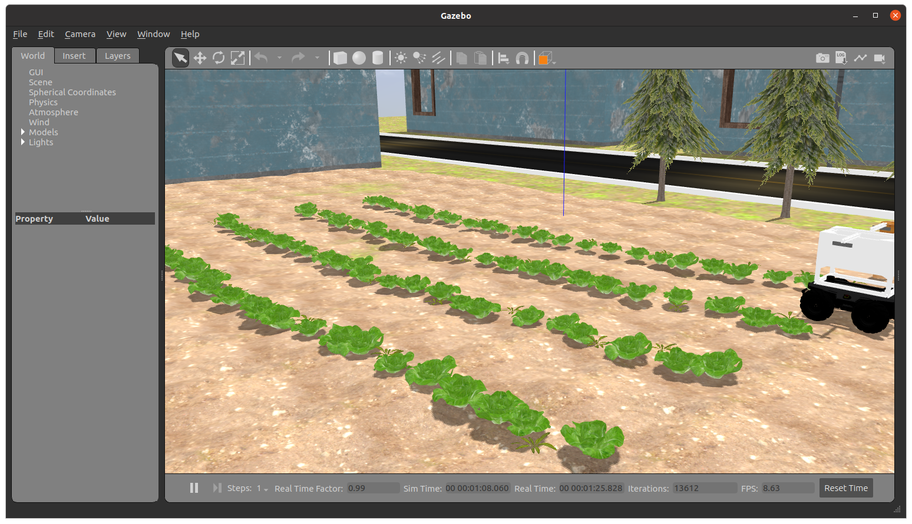
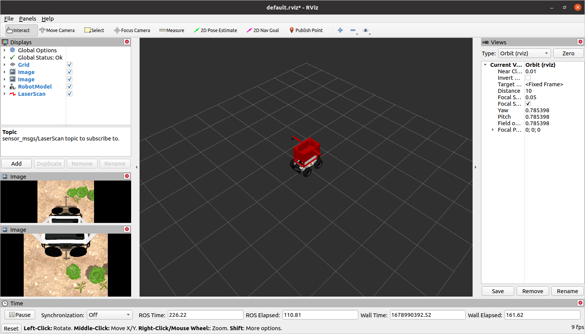

# How to set up your workspace


In this tutorial, you will set your set up a directory on your ROS-enabled PC as your workspace for development and install the competition ROS packages. Please follow the instructions below carefully.

!!! note
    This can ONLY be completed after you have set up your PC (by following the tutorial here: [Setting up your PC](../getting-started-tutorials/setting-up-your-pc.md)).

!!! note
    If you are using a Docker container, you can skip this tutorial and follow the instructions in [Setting up your workspace (Docker)](../getting-started-tutorials/setting-up-your-workspace-docker.md) instead.

### Setup ROS workspace

<!-- First, we create a new directory in your home directory called `catkin_ws` with a subdirectory `src`. Then we initialize the directory as a catkin workspace. -->

Open a new terminal on your PC, then copy and paste the following one line at a time:
```sh
mkdir -p ~/catkin_ws/src
cd ~/catkin_ws/src
catkin_init_workspace
```


### Clone the repository

In the same terminal (or in a new one), copy and paste the following:
```sh
cd ~/catkin_ws/src
git clone --recurse-submodules https://github.com/PARC-Robotics/PARC-Engineers-League.git
```
Or if you already have cloned the repo without submodules, run command `git submodule update --init --recursive` to update them.

### Install dependencies

In the same terminal (or in a new one), copy and paste the following:
```sh
cd ~/catkin_ws
sudo apt update
rosdep install --from-paths ./src --ignore-src -y
```

!!! Warning
    There is a known issue with one of our dependencies that might cause the `rosdep` command to fail. If you encounter this issue, manually install the dependency by running the following command:
    ```sh
    sudo apt install ros-noetic-teleop-twist-keyboard libasio-dev
    ```

### Compile packages
```sh
cd ~/catkin_ws
catkin_make
source ~/catkin_ws/devel/setup.bash
```


### Set up ROS environment
To set the environment every time you launch a new terminal, following this command:

```sh
echo "source ~/catkin_ws/devel/setup.bash" >> ~/.bashrc
source ~/.bashrc
```

As you develop, it is good to set the environment variables whenever you run a `catkin_make` command to compile changes to your packages. You can do that by:
```sh
source ~/catkin_ws/devel/setup.bash
```


### Test installation

If you completed the preceding tasks successfully, you should be able to run this ROS launch command and see the Gazebo simulator and RViz simulator open with the following display:
```sh
roslaunch parc-robot parc_task2.launch
```

Gazebo Simulator window



RViz window


If you run the following command in a new terminal,
```
rqt_graph
```
You will see a screen like this:


You need to `publish`/write to the `topic` `/cmd_vel` to move the robot.
The following guide will help you control the robot using keyboard. Once you have tested that, you can follow the [understanding-ros](../getting-started-with-ros) guide to write a python program to control the robot.

### Controlling the robot using keyboard
Run the following command in a new terminal
```sh
source ~/catkin_ws/devel/setup.bash
roslaunch parc-robot teleop.launch
```

Now keeping the second terminal on top (teleop.launch) press `i` to move the robot forward, you can see the robot moving in "RViz" and "Gazebo" windows.
you can use the keys shown below to move the robot and `k` key to stop the movement.
```sh
Moving around:
   u    i    o
   j    k    l
   m    ,    .
```
